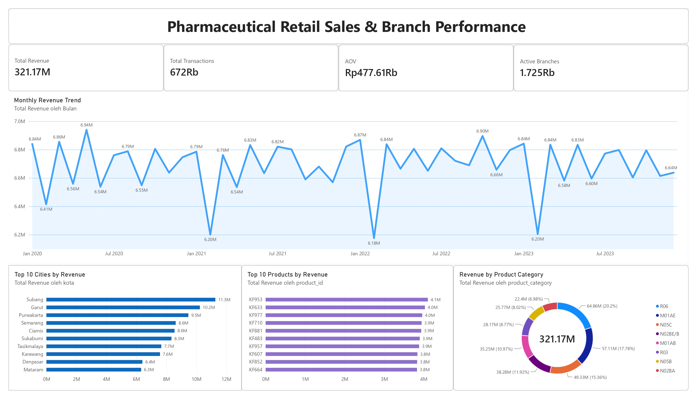

# Pharmaceutical Retail Sales & Branch Performance Analysis
Pharmaceutical retail sales analysis using SQL and Power BI to evaluate sales performance, customer transactions, product performance, and inventory.

## Project Overview

This project analyzes pharmaceutical retail transaction, branch, product, and inventory data to evaluate business performance and identify key patterns that can support data-driven decision making.

The analysis covers pharmaceutical retail transactions from **2020 to 2023** and focuses on four main areas:

- Sales Performance
- Branch Performance
- Product Performance
- Inventory

The project uses **Excel** for initial data preparation, **MySQL** for data validation and SQL-based business analysis, and **Power BI** for data visualization and executive dashboard development.

The final output is an interactive Power BI dashboard supported by SQL analysis and business recommendations.

---

## Business Objective

The objective of this project is to understand pharmaceutical retail business performance by analyzing sales trends, branch performance, product contribution, and inventory records.

The analysis aims to:

- Evaluate revenue and transaction performance over time
- Identify differences in branch performance
- Examine the relationship between branch rating and revenue
- Identify high-contributing products and product categories
- Evaluate inventory distribution and zero-stock records
- Translate analytical findings into actionable business recommendations

---

## Business Questions

The analysis was designed to answer the following business questions:

1. How does sales performance develop over time?
2. Which branches or locations generate the highest and lowest revenue?
3. Is there a meaningful relationship between branch rating and revenue?
4. Which products and product categories contribute the most revenue?
5. How is inventory distributed, and how frequently do zero-stock records occur?

---

## Dataset

The project uses four main datasets:

| Table | Records |
|---|---|
| `transaction` | 672,458 |
| `product` | 150 |
| `cabang` | 1,725 |
| `inventory` | 1,035,000 |

### Transaction Period

The transaction dataset covers:

**1 January 2020 – 30 December 2023**

### Main Fields

#### Transaction

- `transaction_id`
- `date`
- `branch_id`
- `customer_name`
- `product_id`
- `price`
- `discount_percentage`
- `rating`

#### Product

- `product_id`
- `product_name`
- `product_category`
- `price`

#### Branch

- `branch_id`
- `branch_category`
- `branch_name`
- `kota`
- `provinsi`
- `rating`

#### Inventory

- `Inventory_ID`
- `branch_id`
- `product_id`
- `product_name`
- `opname_stock`

---

## Tools & Technologies

| Tool | Purpose |
|---|---|
| **Excel** | Data cleaning and preparation |
| **MySQL** | Database management, validation, and SQL analysis |
| **Power BI** | Data visualization and executive dashboard |

---

## Data Preparation & Cleaning

Before importing the data into MySQL, the datasets were prepared and checked for structural consistency.

The data preparation process included:

- Checking column structures
- Standardizing date formats
- Checking numeric data types
- Removing unnecessary trailing empty columns
- Ensuring consistent CSV delimiters
- Preparing the datasets for MySQL import

The transaction data originally contained additional empty columns, which were removed before the final import.

---

## Data Validation

Data validation was performed after importing the datasets into MySQL.

The validation process included:

- Row count validation
- Duplicate record checks
- NULL value checks
- Primary key uniqueness checks
- Foreign key relationship checks
- Table grain validation
- Relationship validation
- Potential JOIN duplication checks

### Validation Results

No NULL values were found across the four main tables.

The key identifiers were also validated for uniqueness according to their respective table structures.

### Table Grain

| Table | Grain |
|---|---|
| `transaction` | 1 row = 1 transaction for 1 product at 1 branch on 1 date |
| `product` | 1 row = 1 product |
| `cabang` | 1 row = 1 branch |
| `inventory` | 1 row = 1 inventory record |

A key finding during validation was that `inventory` contains multiple records for the same `branch_id` and `product_id`. Therefore, directly joining transaction and inventory at row level could duplicate transactions and inflate revenue.

---
## SQL Analysis

## Sales Performance

The sales analysis focused on:

- Total Revenue
- Total Transactions
- Average Transaction Value (AOV)
- Monthly Revenue
- Annual Revenue
- Year-over-Year (YoY) Performance

### Overall Results

| Metric | Result |
|---|---:|
| Total Revenue | **Rp321.17 Billion** |
| Total Transactions | **672,458** |
| AOV | **Rp477,607.81** |

---

## Branch Performance

The branch analysis evaluated:

- Revenue by branch
- Transaction volume
- AOV
- Branch rating
- Revenue by rating group
- Relationship between branch rating and revenue

### Key Results

- **Highest-performing branch:** ~Rp220.25M
- **Lowest-performing branch:** ~Rp152.93M
- **Revenue difference:** ~44%

The Pearson correlation between branch rating and revenue was:

**r = -0.00644**

This indicates virtually no meaningful linear association between branch rating and revenue in the analyzed dataset.

---

## Product Performance

The product analysis evaluated:

- Top products by revenue
- Top products by transaction frequency
- Revenue by product category
- Category revenue contribution

### Top Product by Revenue

**KF953 — ~Rp4.11B**

### Top Revenue-Contributing Categories

| Product Category | Revenue Contribution |
|---|---:|
| R06 | **20.20%** |
| M01AE | **17.78%** |
| N05C | **15.36%** |
| **Combined** | **53.34%** |

The three largest product categories contributed **53.34% of total revenue**.

---

## Inventory Analysis

The inventory analysis evaluated:

- Recorded inventory
- Stock distribution
- Average recorded stock
- Zero-stock records
- Zero-stock rate by product and branch

### Key Results

| Metric | Result |
|---|---:|
| Inventory Records | **1,035,000** |
| Total Recorded Stock | **51,747,118** |
| Average Recorded Stock | **49.997** |
| Zero-stock Records | **10,254** |
| Zero-stock Rate | **~0.99%** |

The inventory dataset does not contain a date or stock snapshot field. Therefore, zero-stock records cannot be interpreted as confirmed current stock-out conditions.

---

## Power BI Dashboard

An executive dashboard was developed in Power BI to communicate the main findings from the analysis.

### Dashboard Includes

- Total Revenue
- Total Transactions
- AOV
- Active Branches
- Monthly Revenue Trend
- Top 10 Cities by Revenue
- Top 10 Products by Revenue
- Revenue by Product Category

### Dashboard Preview

---

# Key Insights

### 1. Revenue remained relatively stable

Annual revenue remained around **Rp80B per year** throughout 2020–2023, indicating no consistent growth trend.

In 2023:

- Revenue decreased **0.57% YoY**
- Transactions decreased **0.70% YoY**
- AOV increased **0.12% YoY**

The slight decline in revenue was therefore more aligned with lower transaction volume, while AOV continued to increase slightly.

**Business implication:**  
The main growth opportunity is increasing transaction volume rather than relying solely on increasing the average value of each transaction.

---

### 2. Branch performance varies across locations

Observed branch revenue ranged from approximately **Rp153M to Rp220M**, representing a difference of around **44%** between the highest- and lowest-performing branches.

This indicates that branch performance varies considerably across locations.

**Business implication:**  
Differences in transaction volume, AOV, product mix, and local market characteristics should be investigated to understand the drivers of branch performance.

---

### 3. Branch rating is not strongly associated with revenue

The Pearson correlation between branch rating and revenue was **-0.00644**, indicating virtually no meaningful linear association.

This means that higher branch ratings were not associated with higher revenue in the analyzed dataset.

However, this does not imply that customer experience is unimportant. It indicates that branch rating alone is not sufficient to explain revenue differences.

**Business implication:**  
Branch performance should be evaluated using multiple indicators rather than relying on customer rating alone.

---

### 4. Revenue is concentrated in several product categories

The three largest product categories—**R06, M01AE, and N05C**—contributed a combined **53.34% of total revenue**.

This means that more than half of total revenue came from only three product categories.

**Business implication:**  
These categories should receive greater attention in product availability, assortment planning, promotional strategies, and inventory management.

---

### 5. Transaction frequency does not always indicate revenue contribution

Products with high transaction frequency are not necessarily the products generating the highest revenue.

This is because products have different selling prices and therefore contribute different amounts of revenue per transaction.

For example, **KF943** had high transaction frequency but relatively low revenue because of its low product price.

**Business implication:**  
Product performance should be evaluated using both transaction frequency and revenue contribution instead of relying on a single metric.

---

### 6. Zero-stock records are relatively limited

Zero-stock records represented approximately **0.99% of inventory records**.

This indicates that zero-stock observations were relatively limited within the available inventory data.

However, the absence of inventory dates or stock snapshots prevents deeper analysis of:

- Stock movement over time
- Stock-out duration
- Recurring stock-outs
- Replenishment timing
- Inventory trends

**Business implication:**  
The current inventory data provides a useful overview of recorded stock conditions, but additional time-based inventory data is required for more effective inventory planning.

---

# Business Recommendations

### 1. Increase Transaction Volume

Since revenue remained relatively stable and transaction volume declined slightly in 2023, the business should focus on initiatives that increase transaction frequency.

Potential initiatives include:

- Customer retention programs
- Targeted promotions
- Repeat-purchase campaigns
- Cross-selling complementary products
- Personalized product recommendations

**Expected business value:**  
Higher transaction frequency can create revenue growth without relying solely on increasing transaction value.

---

### 2. Benchmark High-Performing Branches

High-performing branches should be compared with lower-performing branches to identify potential performance drivers.

The comparison can include:

- Transaction volume
- AOV
- Product mix
- Product availability
- Location characteristics
- Customer demand patterns

Best practices identified from high-performing branches can then be considered for implementation in lower-performing locations.

---

### 3. Use Multiple Metrics to Evaluate Branches

Branch rating should not be used as the primary indicator of branch performance because the analysis found virtually no linear relationship between rating and revenue.

A broader branch performance framework should combine:

- Revenue
- Transaction volume
- AOV
- Customer rating
- Product mix
- Inventory availability

This provides a more comprehensive view of branch performance.

---

### 4. Prioritize High-Contribution Product Categories

The top three product categories contribute **53.34% of total revenue** and therefore represent important revenue drivers.

Management should prioritize these categories through:

- Availability monitoring
- Inventory allocation
- Assortment planning
- Promotional campaigns
- Regular performance monitoring

Maintaining strong availability and performance in these categories can help protect a significant portion of total revenue.

---

### 5. Develop Different Strategies for Different Product Profiles

Products should be evaluated based on both transaction frequency and revenue contribution.

For example:

| Product Profile | Recommended Strategy |
|---|---|
| High frequency + high revenue | Prioritize availability and retention |
| High frequency + low revenue | Cross-selling and bundling opportunities |
| Low frequency + high revenue | Targeted promotions and customer segmentation |
| Low frequency + low revenue | Evaluate commercial relevance |

This approach allows product strategies to be aligned with their actual contribution to the business.

---

### 6. Improve Inventory Data Tracking

The current inventory dataset does not contain a date or stock snapshot field, limiting the ability to analyze inventory changes over time.

Future inventory records should include:

- Inventory date
- Stock quantity
- Branch ID
- Product ID
- Stock-in quantity
- Stock-out quantity
- Replenishment quantity

This would enable analysis of:

- Stock movement
- Stock-out frequency
- Stock-out duration
- Replenishment patterns
- Inventory turnover
- Slow-moving products
- Branch-level inventory efficiency

---

### 7. Build a Data-Driven Branch Management Framework

Branch management can use a combination of commercial, customer, product, and inventory metrics to identify performance gaps.

| Dimension | Metric |
|---|---|
| Sales | Revenue |
| Customer Activity | Transactions |
| Customer Spending | AOV |
| Customer Experience | Rating |
| Product | Product & Category Mix |
| Inventory | Stock Availability |

This framework can help management identify whether branch performance differences are related to customer volume, transaction value, product mix, or operational factors.

---

# Conclusion

The analysis shows that pharmaceutical retail revenue remained relatively stable at approximately **Rp80B annually during 2020–2023**, with limited overall growth.

Branch performance varied across locations, while branch rating showed virtually no meaningful linear association with revenue.

Revenue was also concentrated in several major product categories, with the top three categories contributing **53.34% of total revenue**.

The analysis highlights several key business opportunities:

- Increasing transaction volume
- Improving branch performance through benchmarking
- Maintaining high-contribution product categories
- Evaluating products using multiple performance metrics
- Improving inventory data tracking

Overall, this project demonstrates an end-to-end analytical workflow from **data cleaning and validation → SQL analysis → business insights → Power BI visualization → actionable business recommendations**.
